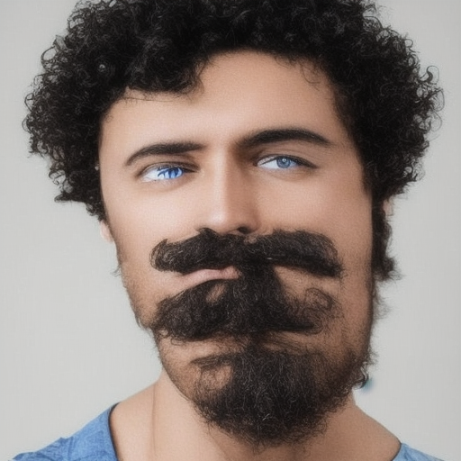
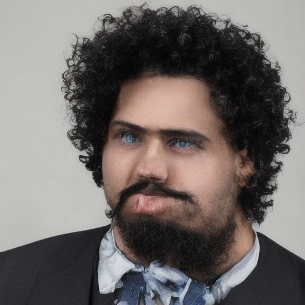
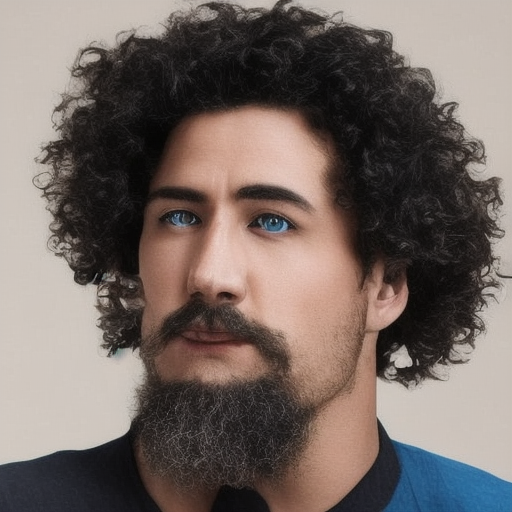
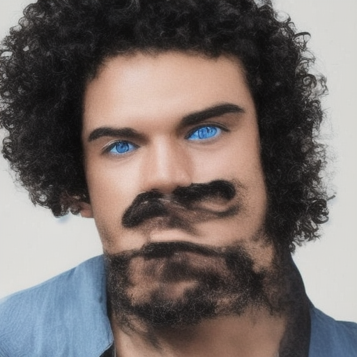

---
license: creativeml-openrail-m
base_model: segmind/tiny-sd
tags:
- stable-diffusion
- stable-diffusion-diffusers
- text-to-image
- diffusers
- lora
inference: true
---
    
# LoRA text2image fine-tuning - TeddyVDobreva/5e-4_30hyperparameter_tuning
These are LoRA adaption weights for segmind/tiny-sd. The weights were fine-tuned on the AML-group10/AML_project_preprocessed_dataset dataset. You can find some example images in the following. 

