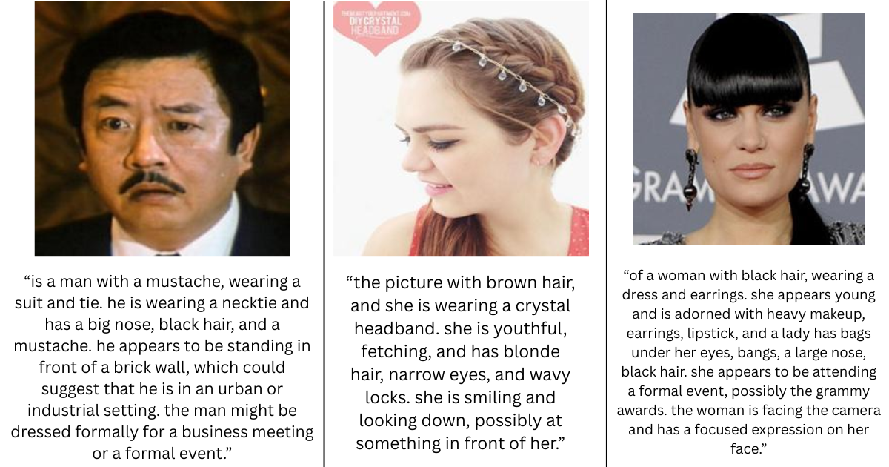
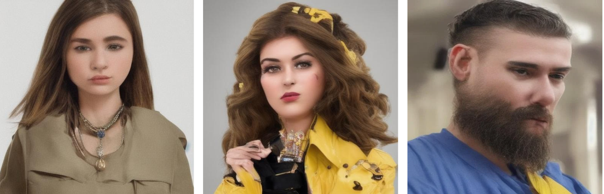

# Stable Diffusion Fine-Tuning with LoRA
### Baseline vs Fine-Tuned Comparison

**Course:** Applied Machine Learning  
**Group:** 10  
**Authors:** Julia Włodarska, Sophia Sara Lopotaru, Teodora Dobreva

---

## Overview

This project investigates how LoRA (Low-Rank Adaptation) fine-tuning affects image generation quality in
Stable Diffusion, using the OpenFace-CQUPT dataset with human captions. We trained nine fine-tuned variants by
performing a grid search over three learning rates and three epoch counts. We compared the best of those models with the pre-trained baseline using quantitative evaluation metrics.

---

## Dataset
The dataset consists of around 10 million samples of images found on the internet, with human captions explaining them (OpenFaceCQUPT). We used 12,000 randomly chosen samples from the dataset with human captions. The format of the images is JPEG.

Link to the original dataset: https://huggingface.co/datasets/OpenFace-CQUPT/FaceCaption-15M

Both images and the captions were preprocessed by removing images containing multiple individuals or depicting nudity, and excluding extremely low CLIP-scored images. We applied face detection to localize facial regions and used the resulting bounding boxes to crop each image, ensuring that only the face region was retained for subsequent processing. All the detailed preprocessing scripts are available in 'src/preprocessing/'. 

Link to the preprocessed dataset: https://huggingface.co/datasets/AML-group10/AML_project_preprocessed_dataset 

The examples of image-caption pairs included in the dataset after preprocessing are depicted below.



---

## Model details

As the baseline, we used Segmind Tiny-SD, which is a lightweight distilled version of Stable Diffusion designed for fast and efficient image generation. Tiny-SD is derived from larger Stable Diffusion models through knowledge distillation. The model is trained on preprocessed text–image datasets and optimized for efficient deployment, making it suitable as a strong baseline for further fine-tuning and research in lightweight generative models.

Link to the Segmind Tiny Stable Diffusion baseline model: https://huggingface.co/segmind/tiny-sd

The code for training the model are included in 'src/models/training/'.

---

## Hyperparameter Tuning

The fine-tuning method used was Low-Rank Adaptation (LoRA). UNet attention layers were fine-tuned. Nine LoRA-adapted variants are stored under 'src/models/finetuned_models/', one per hyperparameter combination. Each fine-tuned model contains its LoRA weights and training config.

We performed a full grid search across following values:
| Hyperparameter | Values |
|---|---|
| Learning rate | `1e-4`, `3e-4`, `5e-4` |
| Number of epochs | `10`, `15`, `20` |
| LoRA rank (r) | `4` (fixed) |
| LoRA alpha | `4` (fixed) |
| Resolution | `256×256` (fixed) |
| **Total models** | **9** |

---

## Repository structure
```
AML-PROJECT/
├── archive/                 # Archived experiments
│   ├── cvae/                # CVAE-based experiments
│   ├── diffusion_models/    # Diffusion model experiments
│   ├── dog/                 # Dataset experiments
│   ├── lora-output/         # Test LoRA training outputs
│   └── tests/               # Experimental test scripts
│
├── deployment/             # Deployment utilities
│
├── src/
│   ├── evaluation/         # Evaluation and metric computation
│   ├── models/
│   │   ├── finetuned_models/  # 9 fine-tuned LoRA weights + configs
│   │   └── training/          # LoRA training scripts
│   │
│   ├── preprocessing/      # Data preprocessing pipelines
|   |   └── notebooks/      # Data preprocessing notebooks
│   └── results/            # Generated outputs + experiment logs
|   |   └── validation_results/ # Results of the hyperparameter tuning
│
├── README.md
├── requirements.txt
├── run_inference.sh
└── proposal.pdf
```

--- 

## Requirements

- Python 3.10+
- uv

## Setup

1. Clone the repository:
```bash
git clone https://github.com/AML-group10/AML-project.git
cd AML-project
```

2. Install dependencies using uv:
```bash
pip install uv
source .venv/bin/activate
uv sync
```

---

## How to Run

### Fine-tuning
Running a full grid search:
```bash
bash src/models/training/hyperparameter_tuning.sh
```

To train a single configuration instead, the example prompt is presented below. Remember to adjust your own values of the parameters.

```bash
python3 src/models/training/lora_training.py \
    --pretrained_model_name_or_path="segmind/tiny-sd" \
    --dataset_name="AML-group10/AML_project_preprocessed_dataset" \
    --dataset_config_name="train" \
    --output_dir="./AML-group10/1e-4_10_hyperparameter_tuning" \
    --use_peft \
    --lora_r=4 \
    --lora_alpha=4 \
    --resolution=256 \
    --train_batch_size=512 \
    --gradient_accumulation_steps=1 \
    --num_train_epochs=10 \
    --learning_rate=1e-4 \
    --caption_column="prompt" \
    --push_to_hub \
    --allow_tf32 \
    --validation_epochs \
    --validation_prompt="a man with curly black hair, blue eyes and a moustache" \
    --seed=67
```

### Inference
Generate single image from any model:

```bash
python src/models/training/single_im_generation.py \
    --prompt <YOUR PROMPT> \
    --output <FILE NAME>
```

Example command would be:
```bash
python src/models/training/single_im_generation.py \
    --prompt "a man with a beard and blue eyes" \
    --output man_beard.jpeg
```

---

## Results
Results are stored in 'src/results/'. A summary of validation metrics is as follows:

| Model | Learning Rate | Epochs | FID ↓ | CLIP Score ↑ |
|---|---|---|---|---|
| Fine-tuned | 1e-4 | 10 | 98.490 | 0.164 |
| Fine-tuned | 1e-4 | 15 | 95.315 | 0.164 |
| Fine-tuned | 1e-4 | 20 | 92.914 | 0.165 |
| Fine-tuned | 3e-4 | 10 | 96.737 | 0.164 |
| Fine-tuned | 3e-4 | 15 | 87.054 | 0.164 |
| Fine-tuned | 3e-4 | 20 | 86.798 | 0.164 |
| Fine-tuned | 5e-4 | 10 | 88.115 | 0.163 |
| Fine-tuned | 5e-4 | 15 | 84.799 | 0.163 |
| Fine-tuned | 5e-4 | 20 | 84.956 | 0.164 |

FID (Frechet Inception Distance) measures image quality and diversity (the lower the better). CLIP Score measures prompt-image alignment (the higher the better).

The best model was found to be the one with learning rate 5e-4 and 20 epochs. The example images it generates are presented below.

---

## Example images generated by the best model



---

# Deployment

The backend is implemented in the ```original_server.py``` file, and the frontend 
can be found in the ```demo.py``` file.

To run the deployment, paste the following command into your terminal:
```
uvicorn deployment.original_server:app --reload
```
Create a second terminal window, and run the following command:
```
streamlit run deployment/demo.py --server.port 8067
```
By now, you should be redirected to your browser: ```http://localhost:8067```. 

If you followed these steps, you should be seeing this.


To use the model, you simply write your prompt into the text box, and click the **Generate** button.

In order to see the documentation, access the following link:
```http://localhost:8000/docs```.

To check if the API is functional, you can do so using the link:
```http://localhost:8000/health```.
